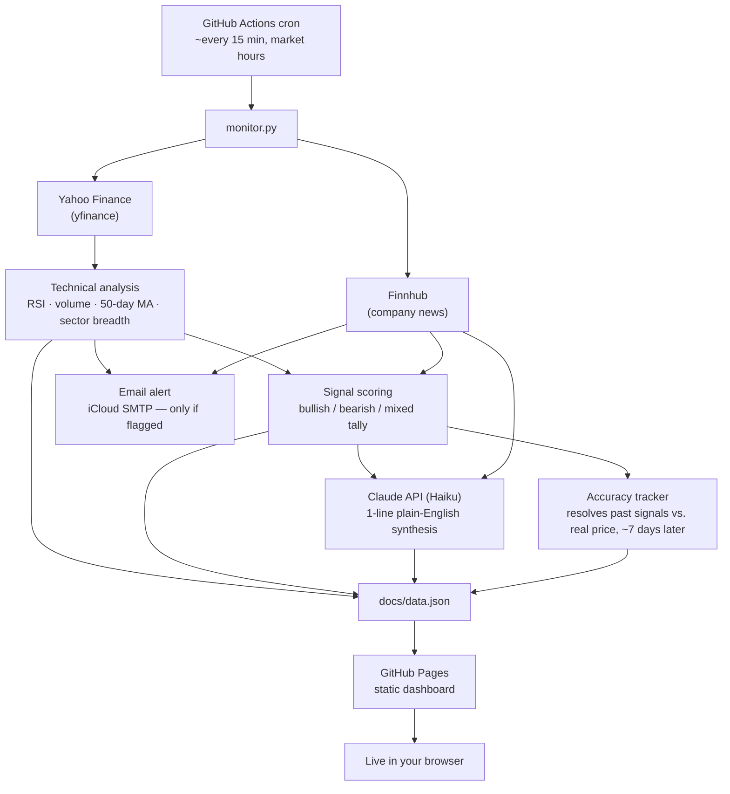

# Stock Watchlist Monitor

A self-updating stock watchlist that runs entirely on free infrastructure — no server, no database, no hosting bill. A scheduled script checks your stocks every ~15 minutes during market hours, runs some real technical analysis on them, asks Claude to synthesize a plain-English read, and publishes the result to a live dashboard. It emails you only when something actually crosses a threshold — never a constant stream of noise. It never places a trade.

[](https://github.com/MaxS2006/stock-watchlist/actions/workflows/tests.yml)
[](https://github.com/MaxS2006/stock-watchlist/actions/workflows/watchlist.yml)

**[→ View the live dashboard](https://maxs2006.github.io/stock-watchlist/)**

> **Not financial advice.** This is a personal informational project. It never executes a trade, and nothing it displays is a recommendation to buy or sell anything — see [Disclaimer](#disclaimer).

---

## What it does

Point it at a list of tickers and it will, on its own, every ~15 minutes during US market hours:

- Pull current price history from Yahoo Finance and recent company news from Finnhub
- Compute real technical indicators — RSI(14), volume vs. its own average, position relative to the 50-day moving average, and whether a move looks stock-specific or sector-wide
- Tally those into a plain signal (`LEANS POSITIVE`, `LEANS NEGATIVE`, `MIXED SIGNALS`, `NOTHING COMPELLING`) — deliberately never buy/sell language
- Ask Claude to write a one-line synthesis combining the technicals with the news, but *only* when something actually changed since the last check (keeps API cost negligible)
- Track its own track record: every directional call gets checked against what the price actually did about a week later
- Update a live dashboard, and send an email **only** if a stock crosses a drop threshold or has notable news — not on every run

It also scans a wider pool of ~80 large-cap tickers for notable movers, and shows a compact market-context strip (S&P 500, Nasdaq, Dow, and four sector ETFs) — both clearly separated from the core watchlist so they never get confused with an actual tracked signal.

## Architecture



Everything runs inside a single scheduled GitHub Actions job — there's no backend to host or pay for. `monitor.py` does the work and writes `docs/data.json`; `docs/index.html` is a static page with no build step that fetches that JSON client-side and renders it (candlestick charts, signal bars, tooltips, the works). A second, independent GitHub Actions workflow runs the test suite on every push, regardless of the schedule.

## Tech stack

| Layer | Choice |
|---|---|
| Language | Python 3.12 |
| Price data | [Yahoo Finance](https://finance.yahoo.com) via `yfinance` (free, no key) |
| News data | [Finnhub](https://finnhub.io) API (free tier) |
| AI synthesis | [Claude API](https://www.anthropic.com) (Haiku) |
| Technical analysis | `pandas` (Wilder-smoothed RSI, moving averages, breadth classification) |
| Testing | `pytest` — fixture-based, zero network calls |
| Automation | GitHub Actions (scheduled monitor run + CI on push) |
| Hosting | GitHub Pages (static, free) |
| Dashboard | Vanilla HTML/CSS/JS, no framework, no build step |
| Charts | [lightweight-charts](https://github.com/tradingview/lightweight-charts) (TradingView's open-source library) |
| Alerts | Email via iCloud SMTP |

## Engineering notes

A few things about how this was actually built, not just what it does:

**The test suite caught a real bug.** Writing a "known dataset" test for the RSI calculation — cross-validating it against an independently-written reference implementation of the classic Wilder-smoothed formula — surfaced that the production code was actually using pandas' default `.ewm(...).mean()` weighting instead. That's a different, non-standard formula that diverged from the values TradingView or StockCharts would show by a meaningful margin on real price data. Fixed, and verified: I reverted the fix, watched the test fail against the buggy version, then restored it — confirming the test suite actually has teeth, not just passing vacuously.

**GitHub Actions' cron scheduler needed a workaround.** The scheduled workflow ran fine manually but never fired on its own schedule — every run in the history was `workflow_dispatch`, none `schedule`, across multiple full trading days. After ruling out the usual culprits (invalid YAML, a fork, a disabled workflow, a platform incident), the fix was GitHub's own documented behavior: scheduled runs are most likely to be delayed or dropped right at the top of the hour, which is exactly where the original cron (`*/15 13-21 * * 1-5`) landed every time. Offsetting it by a few minutes (`7,22,37,52 13-21 * * 1-5`) fixed it — confirmed by watching real scheduled runs start appearing in the Actions history afterward.

**Signals are checked against reality, not just displayed and forgotten.** Every `LEANS POSITIVE` / `LEANS NEGATIVE` call gets recorded with the price at signal time, then automatically resolved about a week later against what the price actually did — `correct: true/false`, or `null` if the move was flat. It's intentionally scoped down to just this: no dashboard UI for it yet, just the tracked data in `state.json`/`docs/data.json`, ready for a future accuracy view once enough history accumulates.

**API usage is deliberately cheap.** The only paid dependency (Claude) is called per-ticker only when something changed since the last check — new news, an RSI category flip, or a threshold crossed — not on every 15-minute tick. The wider market scans (Notable Movers, Market Overview) use a single batched Yahoo Finance call rather than one request per ticker, so scanning ~90 extra tickers alongside the core watchlist adds a few seconds to the run, not minutes.

**The GitHub Contents API doesn't reliably support CORS — a real API limitation found by testing, not assumed.** The dashboard's editable watchlist first called the Contents API directly (`GET`+`PUT /repos/{owner}/{repo}/contents/tickers.txt`) from client-side JS to read and commit changes. In testing, that endpoint intermittently failed with a browser CORS error, while other API endpoints on the same domain — `/rate_limit`, `/repos/{owner}/{repo}`, `/repos/{owner}/{repo}/actions/...` — worked reliably, across two unrelated repos. GitHub's own docs confirm the Contents endpoint is one of the ones it "may proactively restrict… from browser-based requests." The fix: reads go through `raw.githubusercontent.com` (a different, CORS-reliable service), and writes dispatch a `repository_dispatch` event (confirmed CORS-reliable) that a dedicated workflow picks up to actually edit the file server-side — the same commit pattern the scheduled monitor already uses.

## The dashboard

Each watchlist card shows price, day/week % change, a real interactive candlestick chart, RSI with an Oversold/Overbought/Neutral read, volume vs. its 20-day average, position vs. the 50-day moving average, sector-wide vs. stock-specific classification, earnings-date proximity, the Claude-written synthesis, and the signal bar — every technical term has a hover/tap tooltip explaining it in plain English, aimed at someone with no trading background. A light/dark theme toggle and three accent colors are available, but the green/red up-down colors never change — the one thing that has to stay unambiguous, always does.

A **Manage Watchlist** panel lets you add or remove tickers straight from the dashboard — no editing `tickers.txt` by hand. Adding/removing triggers [`watchlist-edit.yml`](.github/workflows/watchlist-edit.yml) via the GitHub API, which commits the change for you; a newly added ticker gets full price/RSI/signal analysis after the next scheduled run. This needs a GitHub personal access token with permission to trigger a workflow on the repo — the dashboard prompts for it only when you use the feature, and it's kept, at most, in that browser tab's session storage. It is never written into the page's shipped code, so nothing is there for a random visitor to the public dashboard to extract.

## Tests

```bash
pip install -r requirements-test.txt
pytest -v
```

44 tests, fixture data only, no network calls or API keys — they run in under a second and pass identically on a laptop or in CI. Covers RSI calculation, the daily/weekly drop-threshold flagging, the signal-scoring tally, and the accuracy-tracking resolution logic. `.github/workflows/tests.yml` runs this on every push, independent of the scheduled monitor workflow, so a logic regression fails a check before it ever reaches the live dashboard.

## Repo structure

```
.
├── monitor.py                 # the scheduled script: fetch, analyze, synthesize, alert
├── tickers.txt                # core watchlist (edit freely, one ticker per line)
├── movers_pool.txt            # wider large-cap pool for the Notable Movers panel
├── state.json                 # dedup + signal-history state, committed back each run
├── docs/
│   ├── index.html             # the dashboard — static, no build step
│   └── data.json              # regenerated fresh every run, fetched client-side
├── tests/
│   ├── test_rsi.py
│   ├── test_flags.py
│   ├── test_signal.py
│   └── test_accuracy.py
├── requirements.txt
├── requirements-test.txt
└── .github/workflows/
    ├── watchlist.yml          # the scheduled monitor run
    └── tests.yml              # pytest on every push
```

## Running your own copy

<details>
<summary>Full setup steps</summary>

1. **Fork or clone this repo**, then push it to your own GitHub repo (public — GitHub Pages on the free plan only serves from public repos).
2. **Get a free [Finnhub](https://finnhub.io/register) API key** (no card required).
3. **Get an [Anthropic API key](https://console.anthropic.com)** for the synthesis step — the one piece of this stack that costs money, but usage is capped to only re-synthesize when something changed, so it's typically well under a dollar a month for a 10-stock watchlist.
4. **Create an iCloud app-specific password** at [appleid.apple.com](https://appleid.apple.com) → Sign-In and Security → App-Specific Passwords (or adapt `monitor.py`'s SMTP settings for a different provider).
5. **Add repo secrets** (Settings → Secrets and variables → Actions): `FINNHUB_API_KEY`, `ANTHROPIC_API_KEY`, `EMAIL_ADDRESS`, `EMAIL_APP_PASSWORD`, `ALERT_EMAIL_TO`.
6. **Enable GitHub Pages** (Settings → Pages → Deploy from a branch → `main` / `/docs`).
7. **Enable Actions** and run the `Stock Watchlist Monitor` workflow manually once to confirm it works, then let the schedule take over.

Edit [`tickers.txt`](tickers.txt) to change your watchlist, [`movers_pool.txt`](movers_pool.txt) to change the wider scan pool, and the `DAILY_DROP_PCT` / `WEEKLY_DROP_PCT` / `NEWS_KEYWORDS` env values in [`.github/workflows/watchlist.yml`](.github/workflows/watchlist.yml) to tune alert thresholds — all without touching Python.

</details>

## Notes / limits

- Runs entirely on GitHub's free Actions minutes — comfortably within the free tier even on a private-turned-public repo, at ~35 runs/day.
- Yahoo Finance's data via `yfinance` is unofficial and can occasionally hiccup for a given ticker; the script skips a failed ticker rather than failing the whole run.
- Accuracy tracking uses a simple calendar-day window (not a trading-day calendar) — a deliberate simplification, not an oversight.

## Disclaimer

This is a personal, informational side project — not a product, not investment advice, and not built or reviewed by a licensed financial advisor. It never places a trade or connects to a brokerage; it only reads public price/news data and displays what it found. Every number and signal on the dashboard is mechanically generated from technical indicators and should be independently verified before you make any decision with real money.

---

Built by [@MaxS2006](https://github.com/MaxS2006).
